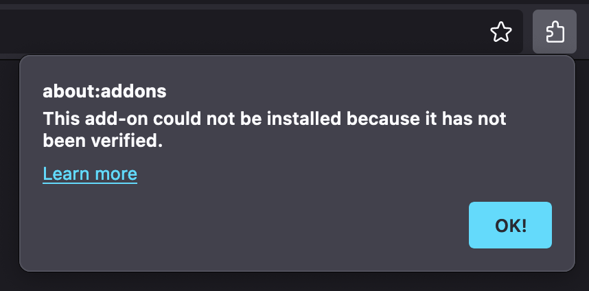
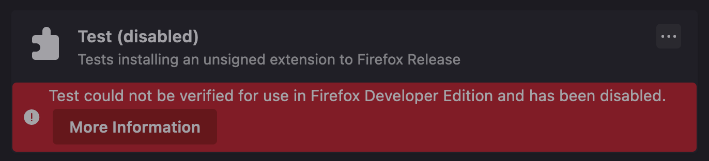
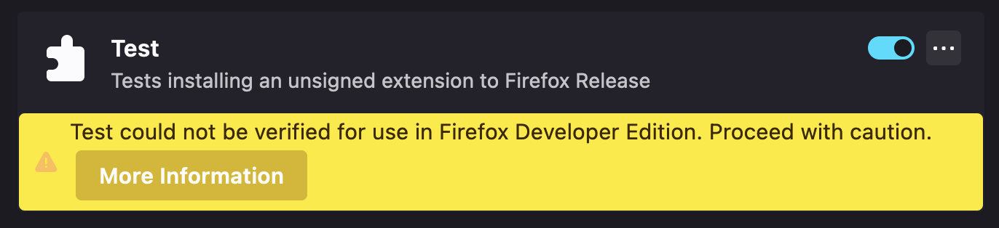

# Firefox Permanent Unsigned Extension

> [!NOTE]
> This is a concluded experiment (attempted reproduction of a blog post) where I
> was unable to reproduce successfully but found a suitable workaround!
>
> To my knowledge, it is not possible to permanently install unsigned extensions
> to Firefox unless Firefox Developer or Firefox ESR is used.
>
> However, it is possible to use AMO to sign the extension (interactive, is not
> delayed by AMO review) and then install it from a file to Firefox!
>
> See the [Conclusion] section.

I use Firefox and I am okay with the fact that Firefox extensions are required
to be signed, but I need an escape hatch for extensions that I authored myself
and want to use without uploading them to AMO.

This is possible to go to `about:debugging#/runtime/this-firefox` and click on
Load Temporary Add-On to load an unsigned add-on until Firefox is restarted.
This won't do for my needs as I have many extensions that I have developed for
myself and it is impractical to reload them all on Firefox restart.
Not to mention the fact that I do not feel as though I should need to do that.

I found a question where someone asked about this on Mozilla's Discourse forums:
https://discourse.mozilla.org/t/what-is-the-easiest-way-to-install-a-local-unsigned-add-on-permanently/52005

The answer says to use Firefox Developer edition and then go to `about:config`
where `xpinstall.signatures.required` can be toggled off to install an unsigned
extension and then back on.

I don't feel as though I should need to use Firefox Developer either.
The answer on this question states that the preference doesn't do anything on
Release or Beta builds of Firefox, though, so it seems Firefox Developer might
be needed?

I found a blog post which spells out the same steps as the question above but
makes no mention of Firefox Developer, it makes it look as though this should
work on Firefox Release:
https://wiringbits.net/browser-extensions/2020/11/27/installing-unsigned-extensions-permanently-to-firefox.html

I decided to try this out so I followed the Firefox extension development quick
start guide to create a test extension:
https://developer.mozilla.org/en-US/docs/Mozilla/Add-ons/WebExtensions/Your_first_WebExtension

1. Create `manifest.json`
2. Set the required `manifest_version`, `name` and `version` fields
3. Leave out `icons` as it doesn't matter for a test extension
4. Set the `description` field
5. Set `content_scripts` which I set to `example.org` to `console.log` on there
6. Go to `about:debugging#/runtime/this-firefox`
7. Click Load Temporary Add-On and find and select `manifest.json`
8. Go to `example.org` and open the developer tools Console tab
9. Verify the expected message has appeared there
10. Quit and restart Firefox
11. Go to `about:debugging#/runtime/this-firefox`
12. Notice the extension is no longer there

So this is not what we want, now let's try following the blog post's steps:

1. Add `browser_specific_settings.gecko.id` to `manifest.json`
2. Set it to any valid email address
3. Go to `about:config` and find `xpinstall.signatures.required`
4. Set `xpinstall.signatures.required` to `false`
5. Go to `about:addons` and click on the hamburger menu
6. Run `zip -r -FS ../my-extension.zip * --exclude '*.git*'`
7. Find and select `my-extension.zip`

At this point the article makes it sound like this should work, but in reality
I get this popup:

So it seems the answer on the question I linked above is correct; this setting
does nothing in Release and Beta builds of Firefox and I do need to be using
Firefox Developer for this to work. :/

I created a PR against the post's source code so that the author can consider
updating it:
https://github.com/wiringbits/wiringbits.github.io/pull/38

Either this worked in 2020 when they published it or they were always using the
Developer / ESR build of Firefox but did not mention it in the post.

## Conclusion

Mozilla manages to disappoint the power user yet again.
The choice is to either use Firefox Developer (or ESR) and suffer the forced use
of the non-happy-path or to succumb to the AMO review shenanigans and suffer the
cycles of review ghosting for a review interleaved with comment-free rejections
and other bullshit which doesn't matter for personal extensions which do not
make sense to be published on AMO in the first place.

## Update: Using Firefox Developer

I decided to verify these steps work in Firefox Developer and I am even more
disappointed now:

The steps to pack the extension, disable extension signature checks and loading
the extension all work, but afterwards, when turning extension signing back on,
I am greeted with this:

The only way to be able to use the extension at all is to keep the extension
signing disabled forever.
When I do that, the screen looks like this now:

In the name of security, Mozilla has forced me to disable signature checks for
all extensions instead of allowing me to grant an exception to an extension I
wrote myself.

## Update: Signing the extension without publishing it on AMO

Alexis who wrote the blog post above mentioned recalling it might be possible to
sign the extension without going through the AMO publishing process.
I assume this includes no need to go through the review and get own extension
reviewed needlessly.

I found steps for signing an extension here on Stack Overflow:
https://stackoverflow.com/a/59172713/2715716

1. Go to AMO and generate an API key: https://addons.mozilla.org/en-US/developers/addon/api/key
2. Install `web-ext` using NPM: `npm install --global web-ext`
    
   It looks like https://github.com/mozilla/sign-addon is an alternative.

3. Run `web-ext sign --api-key="JWT issuer" --api-secret="JWT secret"`
4. Find `web-ext-artifacts/*.xpi`
5. Go to `about:addons` and press the Gear icon
6. Select Install Add-On From File and rejoyce
